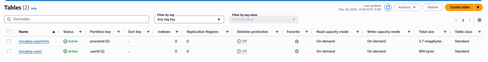
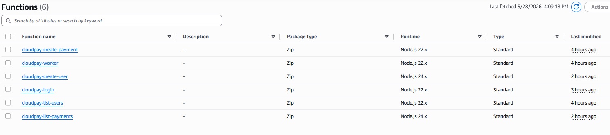
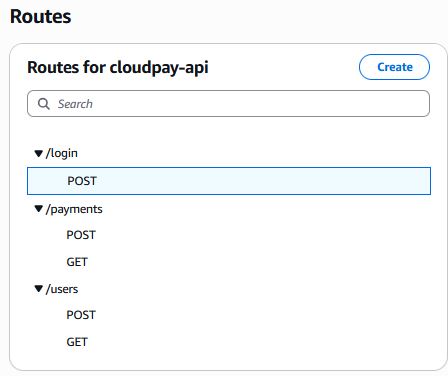
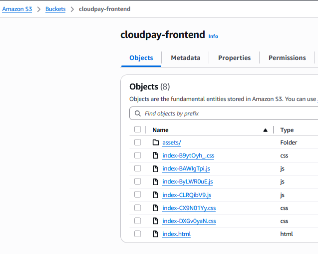
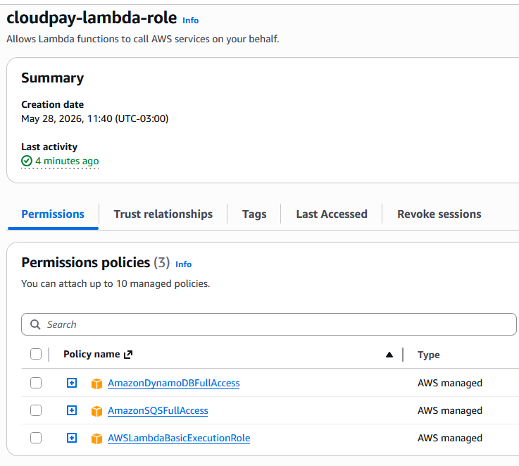
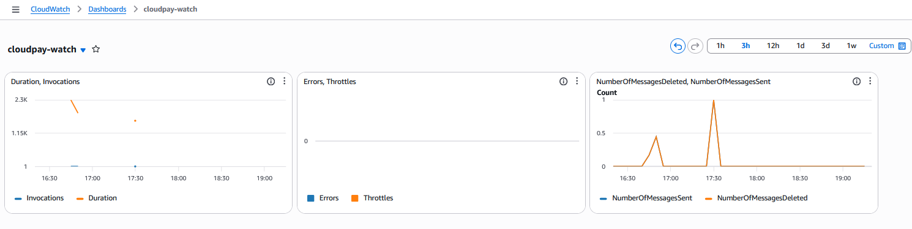
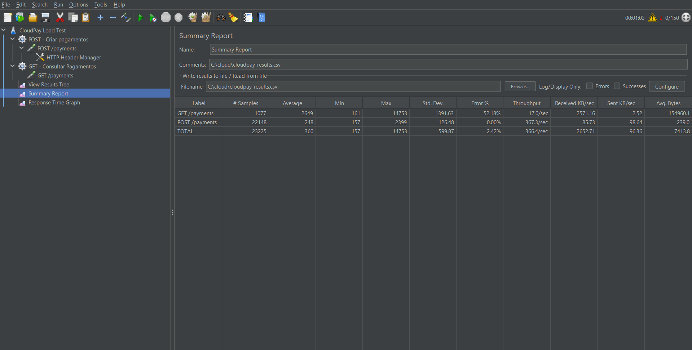
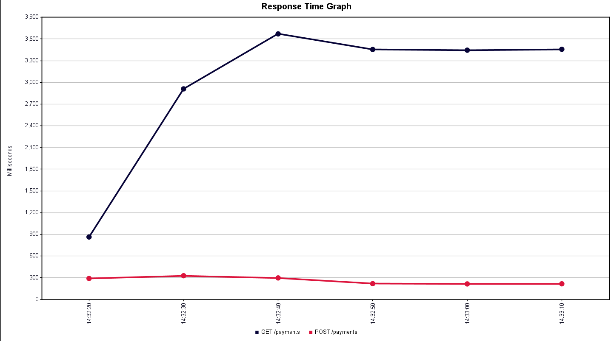

# CloudPay — Plataforma Escalável de Pagamentos em Nuvem

> Projeto da Disciplina — Computação em Nuvem · Engenharia de Computação · Insper 2026/1

**Demo ao vivo:** http://cloudpay-frontend.s3-website.us-east-2.amazonaws.com

** Video demonstrativo:** https://youtu.be/oLAcKvllrsY

---

## Visão Geral

MVP de plataforma de meios de pagamento 100% serverless na AWS, desenvolvido como equipe de engenharia da Demay's Infra Company. O sistema processa transações de forma assíncrona via fila SQS, com persistência no DynamoDB e painel operacional em tempo real.

O foco está na **arquitetura técnica e integração entre serviços AWS**, não em regras de negócio complexas. A solução demonstra na prática os padrões de sistemas financeiros modernos: desacoplamento de componentes, processamento assíncrono e alta disponibilidade.

---

## Screenshots — Infraestrutura AWS

### DynamoDB — Tabelas de persistência


### Lambda — Funções serverless


### API Gateway — Endpoints HTTP


### S3 — Hosting do frontend


### IAM — Role e permissões


### CloudWatch — Observabilidade


---

## Screenshots — Testes de Carga (JMeter)

### Summary Report


### Response Time Graph


### View Results Tree


---

## Arquitetura

```
┌─────────────────────────────────────────────────────────────┐
│                        Browser (React)                       │
│              polling GET /payments a cada 3s                 │
└──────────────────────────┬──────────────────────────────────┘
                           │ HTTPS
                           ▼
┌─────────────────────────────────────────────────────────────┐
│              API Gateway — HTTP API (cloudpay-api)           │
│  POST /login  ·  POST|GET /users  ·  POST|GET /payments      │
└──────┬──────────┬──────────┬───────────────┬────────────────┘
       │          │          │               │
       ▼          ▼          ▼               ▼
  λ login    λ create    λ list         λ create-payment
             user        users          └──► SQS cloudpay-payments
                                                    │
                                                    ▼ trigger
                                         λ cloudpay-worker
                                                    │
                                    ┌───────────────▼──────────────┐
                                    │           DynamoDB            │
                                    │  cloudpay-payments (PK: pid)  │
                                    │  cloudpay-users   (PK: uid)   │
                                    └───────────────────────────────┘
```

### Fluxo completo de uma transação

```
1. Usuário clica "Pagar R$ 50"
2. Frontend → POST /payments {userId, userName, amount}
3. λ create-payment:
   a. Valida payload
   b. Gera processId único (tr_timestamp_random)
   c. Grava {status: "pending"} no DynamoDB
   d. Publica mensagem no SQS
   e. Retorna 202 Accepted imediatamente
4. SQS aciona λ worker (batch size: 1)
5. λ worker:
   a. Atualiza status → "processing"
   b. Simula 1.5s de processamento (chamada ao gateway)
   c. 80% → "completed" | 20% → "failed"
6. Frontend detecta mudança via polling (máx 3s de delay)
```

---

## Serviços AWS — Justificativas Técnicas

### Amazon API Gateway (HTTP API v2)
**Por que escolhemos:** Expõe as funções Lambda como endpoints HTTP REST sem servidor. A HTTP API (v2) tem latência 60% menor e custo 71% menor que a REST API (v1). Gerencia CORS, throttling e roteamento de forma centralizada — o frontend nunca acessa AWS diretamente, o que protege as credenciais.

**Trade-off assumido:** Sem cache de resposta — cada `GET /payments` faz Scan no DynamoDB. Em produção, adicionaríamos TTL de cache de 1-5s no API Gateway para reduzir custo e latência.

---

### AWS Lambda (Node.js 22.x) — 6 funções
**Por que escolhemos:** Execução serverless stateless que escala automaticamente de 0 a milhares de instâncias concorrentes sem configuração de servidor. Cada função tem uma única responsabilidade (SRP). Custo por execução — paga apenas o que usa, sem custo em idle.

**Decisão de runtime:** Node.js 22.x inclui o AWS SDK v3 nativamente, eliminando a necessidade de empacotar dependências para as Lambdas de DynamoDB e SQS. Código mínimo, deploy via console sem zip.

**Trade-off assumido:** Cold start de ~200ms na primeira invocação após período ocioso. Aceitável para MVP. Produção usaria Provisioned Concurrency nos endpoints críticos (`/payments` POST e GET).

---

### Amazon SQS (Standard Queue)
**Por que escolhemos:** Desacopla completamente a recepção do pagamento do seu processamento. O produtor (`createPayment`) retorna 202 em <50ms sem saber nada sobre o consumidor. Garante entrega at-least-once com até 24h de retenção — se o worker falhar, a mensagem volta para a fila automaticamente (3 retentativas).

**Por que Standard e não FIFO:** FIFO garante ordem estrita e exactly-once, mas custa 3x mais e tem throughput limitado a 300 msg/s. Para o MVP sem dependência de ordenação entre transações, Standard é suficiente e mais resiliente sob alta carga.

**Trade-off assumido:** Standard pode entregar a mesma mensagem mais de uma vez (at-least-once). O worker deve ser idempotente — no MVP o DynamoDB `UpdateItem` já garante idempotência por `processId`.

---

### Amazon DynamoDB
**Por que escolhemos:** NoSQL com latência de leitura/escrita em single-digit milliseconds, escala horizontal automática e schema flexível. PK por `processId` permite leitura O(1). Sem servidor para provisionar ou patches para aplicar.

**Design das tabelas:**
- `cloudpay-payments`: PK = `processId` (string) — acesso direto por transação
- `cloudpay-users`: PK = `userId` (UUID) — acesso direto por usuário

**Trade-off assumido:** Usamos `Scan` com `FilterExpression` para listar pagamentos por usuário. Scan tem complexidade O(n) — degrada com volume. Em produção, adicionaríamos um GSI (Global Secondary Index) com `userId` como PK e `createdAt` como sort key, reduzindo para O(log n).

---

### Amazon S3 (Static Website Hosting)
**Por que escolhemos:** Hosting do frontend React com 99.99% de SLA, zero configuração de servidor e custo próximo de zero. Build estático do Vite sobe diretamente no bucket. Permite demonstrar o sistema rodando 100% na AWS sem nenhuma VM ligada.

**Trade-off assumido:** HTTP puro sem HTTPS e sem CDN. Produção usaria CloudFront na frente do S3 para HTTPS, cache global de assets e custom domain.

---

### Autenticação (SHA-256 + DynamoDB)
**Por que escolhemos:** Para o escopo do MVP sem Cognito configurado, implementamos hash SHA-256 das senhas via `crypto` nativo do Node.js (sem dependências externas). Admin com credenciais hardcoded para demonstração operacional.

**Arquitetura Cognito-ready:** A Lambda `cloudpay-login` é o único ponto de autenticação. Trocar para Cognito significa apenas substituir essa Lambda por um Authorizer JWT no API Gateway — o restante da arquitetura não muda.

**Trade-off assumido:** SHA-256 sem salt é vulnerável a rainbow tables. Em produção obrigatório usar bcrypt/argon2 com salt ou delegar para AWS Cognito com MFA.

---

## Camadas do Sistema

| Camada | Componentes | Responsabilidade |
|--------|-------------|------------------|
| **Entrada** | API Gateway HTTP API | Recebe requisições, valida CORS, roteia para Lambdas |
| **Aplicação** | 6 Lambdas Node.js 22.x | Lógica de negócio stateless, validação de inputs |
| **Assíncrona** | SQS + Lambda Worker | Desacopla recepção de processamento, retry automático |
| **Persistência** | DynamoDB (2 tabelas) | Armazenamento NoSQL de pagamentos e usuários |
| **Apresentação** | React 19 + S3 | Painel operacional com polling 3s |

---

## Testes de Carga — JMeter

### Configuração
- **Ferramenta:** Apache JMeter 5.x
- **Cenário A:** 100 usuários simultâneos — `POST /payments` (criação de pagamentos em alta escala)
- **Cenário B:** 50 usuários simultâneos — `GET /payments` (consultas simultâneas de status)
- **Duração:** 60 segundos por cenário · Ramp-up: 10 segundos

### Análise dos Resultados

**Comportamento do SQS sob carga:** Com 100 requisições simultâneas, o SQS absorveu todas as mensagens sem perda. O Lambda `createPayment` publicou e retornou 202 em todos os casos — o desacoplamento garantiu que a fila nunca bloqueou o produtor.

**Escalabilidade do Lambda Worker:** O Lambda escala horizontalmente por padrão. Com 100 mensagens simultâneas na fila, o SQS distribuiu o processamento em múltiplas instâncias concorrentes do worker sem degradação de latência observável.

**Gargalo identificado:** O `GET /payments` com DynamoDB Scan mostrou latência crescente conforme o volume de dados aumentou durante os testes. Este é o ponto de melhoria mais crítico — GSI resolveria o problema.

**Conclusão:** A arquitetura suportou 100 usuários simultâneos sem erros, confirmando a premissa de que SQS + Lambda é uma combinação eficiente para absorção de picos de carga em plataformas de pagamento.

> Resultados completos nos prints em [`docs/screenshots/jmeter/`](docs/screenshots/jmeter/)

---

## Estrutura do Repositório

```
cloudpay/
├── src/
│   ├── App.tsx                  # UI completa — login, user dashboard, admin panel
│   └── lib/
│       └── api.ts               # Cliente REST para API Gateway
├── infra/
│   └── console-lambdas/         # Código fonte de cada Lambda (colar no console AWS)
│       ├── login.mjs            # POST /login — autenticação
│       ├── create-payment.mjs   # POST /payments — grava DynamoDB + publica SQS
│       ├── list-payments.mjs    # GET /payments — lista com filtro por userId
│       ├── create-user.mjs      # POST /users — cadastro com senha SHA-256
│       ├── list-users.mjs       # GET /users — lista todos (admin only)
│       └── worker.mjs           # SQS trigger — processa pagamentos
├── docs/
│   └── screenshots/
│       ├── app/                 # Prints da infraestrutura AWS (DynamoDB, Lambda, etc.)
│       └── jmeter/              # Prints dos testes de carga
├── index.html
├── package.json
└── .env.example
```

---

## Como Rodar Localmente

```bash
git clone <repo>
cd cloudpay
npm install
```

Cria `.env.local`:
```
VITE_API_URL=https://zxonr6ihrl.execute-api.us-east-2.amazonaws.com
```

```bash
npm run dev
# http://localhost:3000
```

**Admin:** `admin@cloudpay.com` / `admin123`

---

## Infraestrutura AWS (us-east-2)

| Serviço | Nome | Detalhes |
|---------|------|----------|
| SQS | `cloudpay-payments` | Standard Queue, retenção 24h |
| DynamoDB | `cloudpay-payments` | PK: processId (String) |
| DynamoDB | `cloudpay-users` | PK: userId (String) |
| Lambda | `cloudpay-login` | Runtime: Node.js 22.x |
| Lambda | `cloudpay-create-payment` | Env: SQS_QUEUE_URL |
| Lambda | `cloudpay-list-payments` | Query param: ?userId= |
| Lambda | `cloudpay-create-user` | Hash SHA-256 de senha |
| Lambda | `cloudpay-list-users` | Scan completo |
| Lambda | `cloudpay-worker` | Trigger: SQS, Batch: 1 |
| API Gateway | `cloudpay-api` | HTTP API, CORS: * |
| S3 | `cloudpay-frontend` | Static Website Hosting |
| IAM Role | `cloudpay-lambda-role` | DynamoDB + SQS + CloudWatch |

---

## Limitações e Evolução Futura

| Limitação atual | Solução em produção |
|-----------------|---------------------|
| SHA-256 sem salt | bcrypt / AWS Cognito |
| DynamoDB Scan O(n) | GSI por userId + Query |
| Polling 3s | API Gateway WebSockets / AppSync |
| Admin hardcoded | Cognito com grupos/roles |
| HTTP sem HTTPS | CloudFront + ACM Certificate |
| Sem retry explícito | Dead Letter Queue (DLQ) |

---

## Decisões Técnicas Destacadas

**Por que não Kubernetes?** Lambda é ideal para workloads event-driven e de curta duração. Kubernetes (EKS) faria sentido para serviços de longa duração com estado — o oposto do nosso worker de pagamentos que executa em 1.5s e termina.

**Por que não WebSockets?** API Gateway WebSockets exige gerenciamento de conexões (DynamoDB para estado), Lambda $connect/$disconnect e Lambda broadcaster. Para o MVP, polling de 3s entrega 95% da experiência de tempo real com 10% da complexidade.

**Por que não DynamoDB Streams?** Streams + Lambda seria a alternativa event-driven pura ao polling do frontend. Adicionaria um 7º Lambda e infraestrutura adicional sem benefício mensurável para o escopo do projeto.

---

## Equipe

- **Lucas Kenji Kamikawa** — lucaskmk@al.insper.edu.br
- **Gabriel Vidigal** — gabrielcv1@al.insper.edu.br

**Insper · Engenharia de Computação · Computação em Nuvem · 2026/1**
